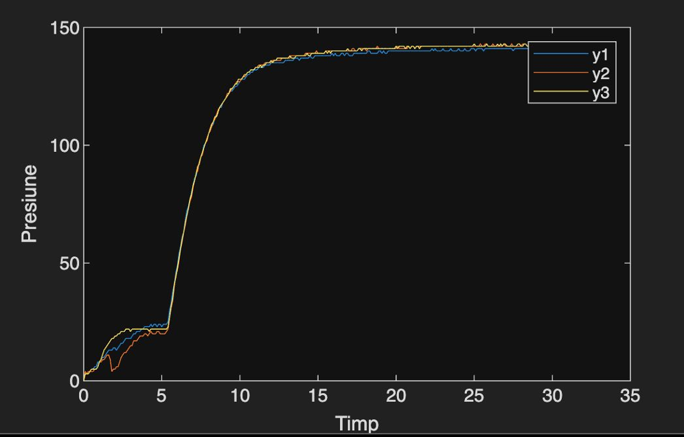
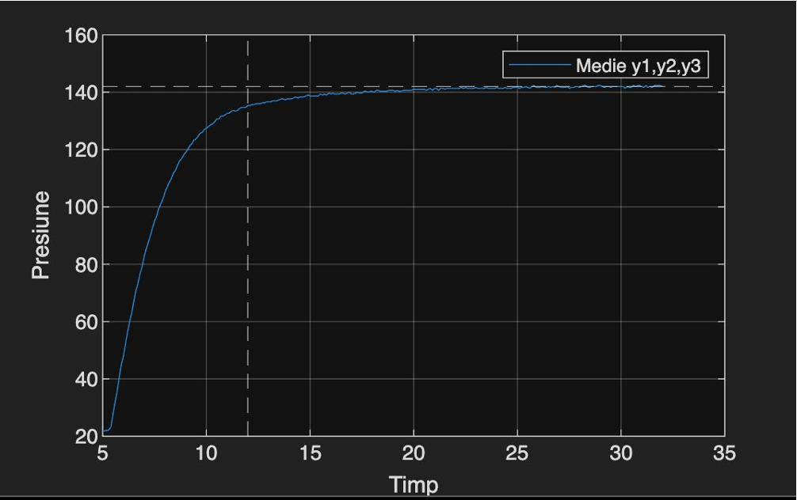
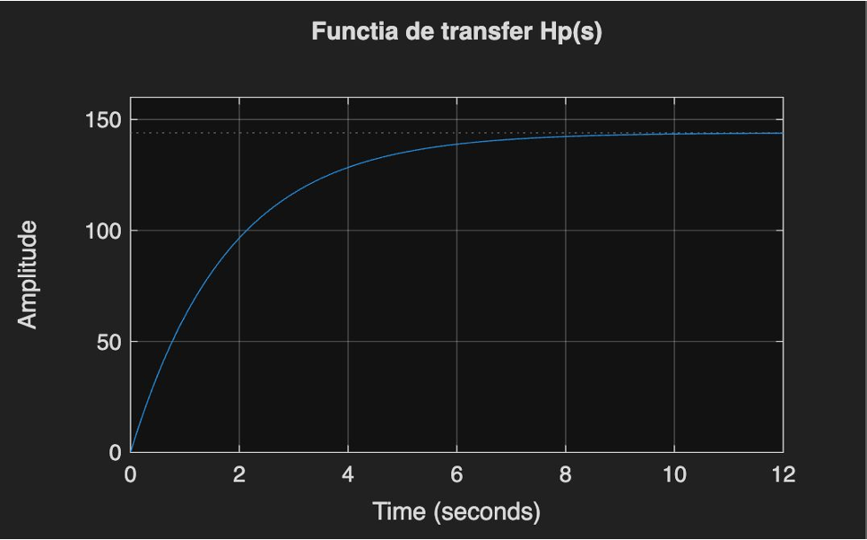
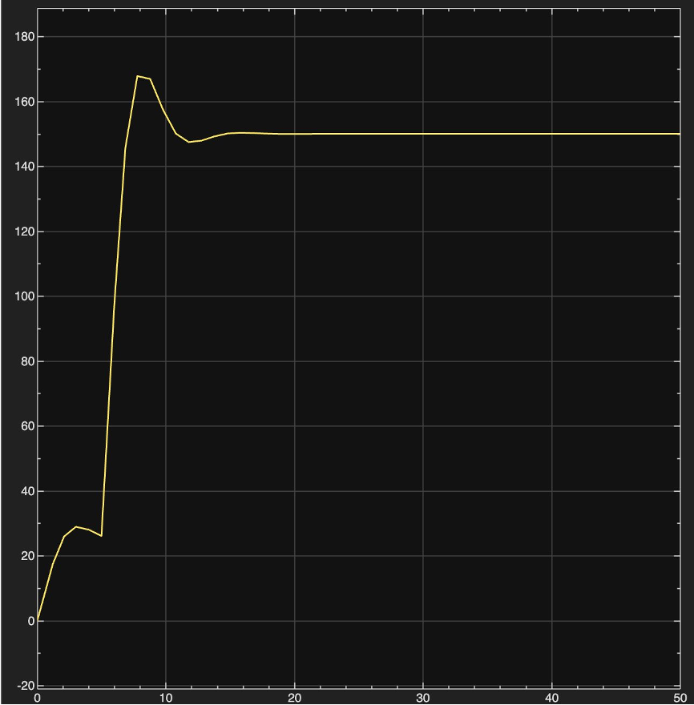
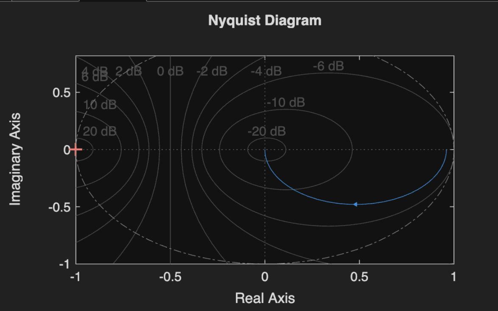
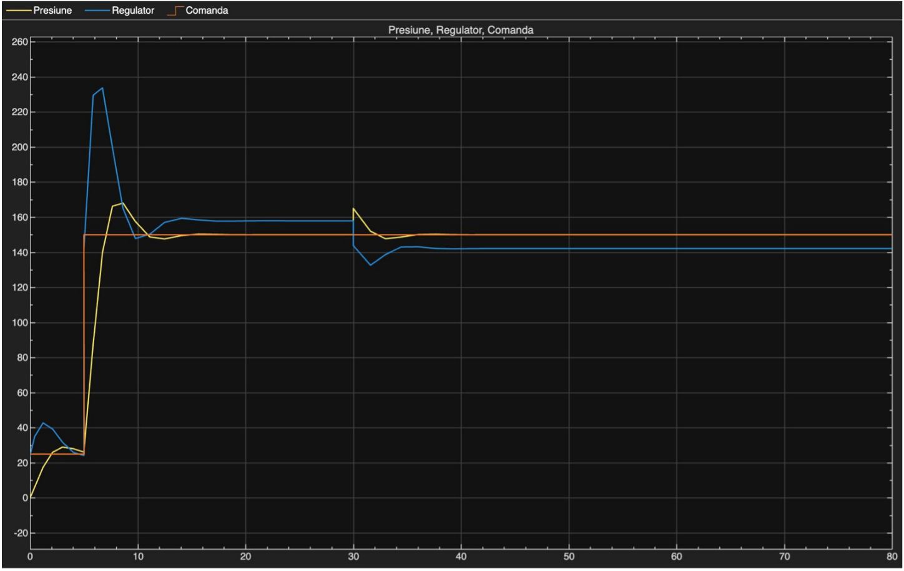
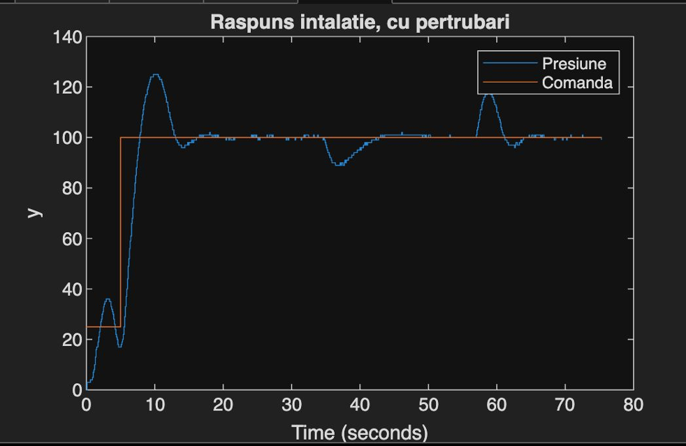
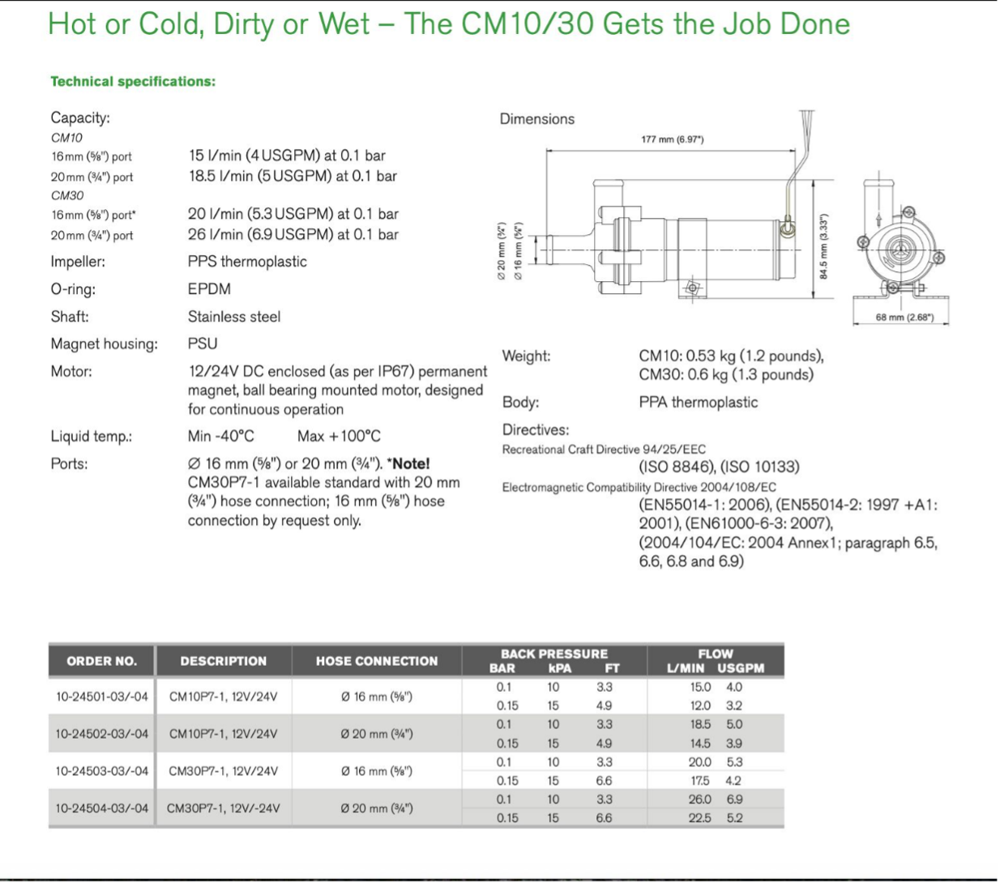

# Pressure Modeling and Control

## Introduction

This project implements a complete pressure control system using PID and cascade control strategies. The system identifies the transfer function of a physical pressure control platform through experimental testing, designs appropriate controllers, and validates performance both in simulation (MATLAB/Simulink) and on real hardware.

## Transfer function identification from step response experiments

To ensure measurement reliability, three identical experimental runs were performed with the same command value of 150. Each measurement was filtered using a low-pass filter to remove noise and measurement artifacts. The three filtered signals were then averaged to produce a single representative response curve. This averaged signal exhibited smooth dynamics without significant fluctuations, making it suitable for transfer function identification. From this final averaged curve, the physical model parameters were extracted, including the steady-state gain, time constant, and system dynamics, which were used to derive the transfer function Hp of the pressure control process.

  
  

The pressure control platform was tested using step commands to characterize system behavior. Three experimental runs were conducted with a reference value of 150 to ensure accurate parameter estimation. However, the system consistently reached a steady-state value of 142, revealing an inherent steady-state error of 8 units. This discrepancy between the commanded value (150) and the achieved output (142) indicated the need for a controller capable of eliminating steady-state error, which motivated the selection of a PID controller with unity gain (Kp = 1) to achieve zero steady-state error in the final implementation.

From the averaged response, the transfer function parameters were calculated:

$$K = \frac{y_{st}}{u} = 0.95 \qquad T = \frac{t_t}{3.9} = 1.8$$

where $y_{st}$ is the steady-state output change, $u$ is the input step change, and $t_t$ is the transient time.

  

The identified transfer function response matches the averaged experimental data, confirming successful model identification of the physical installation.

## Initial PI Controller Design

The controller was designed using the pole-zero method. The process was classified as fast since the time constant $T_1 = 1.8$ s is significantly smaller than the 10s threshold used for system dynamics classification. The imposed performance requirement was zero steady-state error (0%), leading to the selection of a unity gain controller with $K = 1$.

The resulting PI controller transfer function is:

$$H_r = \frac{0.9375}{1.8s + 1}$$

  

With the PI controller, the system now successfully reaches the reference value of 150, eliminating the steady-state error.

  

The Nyquist plot confirms system stability with the designed controller.

  

Simulation results demonstrate excellent disturbance rejection, with the system responding robustly to external perturbations while tracking the reference command.

  

**Physical installation validation:** The experimental results confirm that the PI controller was correctly calculated, with the physical installation performing as predicted by the simulation.

## Analytical Modeling

For analytical modeling of the process, the transfer functions of the execution elements were determined. The pump model was identified, and based on information extracted from the installation manual, the necessary modeling data were established: pump flow rate of 20 l/min and pipe diameter of 20 mm.

The flow process (pressure of water in the installation) was modeled considering the physical principles. The transfer function for the flow process is:

$$H_p = \frac{0.5}{\left(\frac{L^5}{2kFS}\right)s + 1}$$

where $L$ is the pipe length, $k$ is a constant, $F$ is the cross-sectional area, and $S$ is a system parameter.

The execution element transfer function was obtained from the installation documentation:

$$H_{EE} = \frac{K_t}{(Js + b)(Ls + R) + k_e^2}$$

where $K_t$ is the torque constant, $J$ is the moment of inertia, $b$ is the damping coefficient, $L$ is the inductance, $R$ is the resistance, and $k_e$ is the back-EMF constant.

  

The pump documentation provided the necessary parameters $F$ and $S$ for calculating $H_p$.

## Cascade Control Implementation

A PID controller was designed for the analytical model $H_p \cdot H_{EE}$ with the following transfer function:

$$H_{r2} = K_p\left(1 + \frac{T_i}{s} + \frac{T_d s}{T_f s + 1}\right)$$

The imposed performance criteria were:
- Overshoot < 5%
- Settling time $t_t$ < 6 seconds

### Cascade Control Architecture

The cascade control structure places the experimentally identified process (with $H_r$) in the internal loop and the analytical model ($H_p \cdot H_{EE}$ with $H_{r2}$) in the external loop. This configuration is chosen because the pressure process is fast, allowing the inner loop to quickly respond to disturbances before they propagate to the outer loop. The inner loop acts as a fast corrective mechanism, while the outer loop ensures overall system performance and setpoint tracking.

  
  

The cascade control simulation shows significantly smoother response compared to the single-loop controller.

With disturbances applied, the cascade structure demonstrates superior performance. The smoother response is achieved because the inner loop rapidly compensates for disturbances affecting the fast pressure dynamics, preventing them from reaching the outer loop. This two-stage correction mechanism results in reduced oscillations, faster disturbance rejection, and improved overall system stability.
